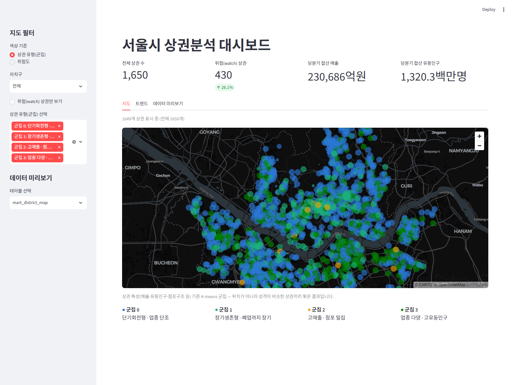
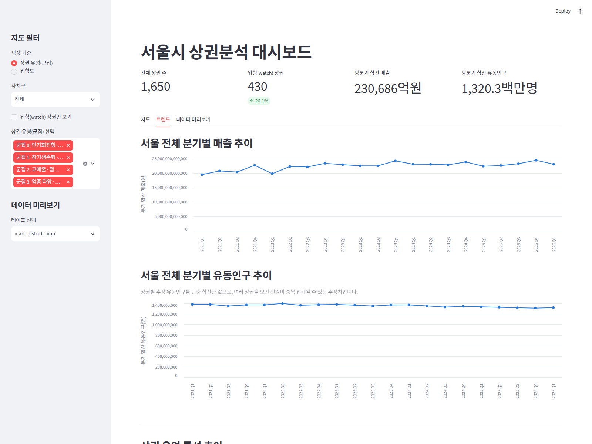

# ソウル市商圏分析プロジェクト

[한국어](README.md) | [日本語](README.ja.md)

ソウルオープンデータ広場の商圏分析公共データを収集 → 整備 → 分析し、業種別・地域別の商圏現況と衰退リスクを可視化するデータエンジニアリングプロジェクトです。

## 実行画面

**マップビュー** — 自治区/リスク度/クラスタでフィルタして商圏を探索します。


**トレンドビュー** — 四半期ごとの売上・流動人口の推移を確認します。


## アーキテクチャ

```
データ収集 (Python + Seoul Open API)
        │
        ▼
   raw layer (DuckDB) ──▶ 商圏クラスタリング (K-means, scripts/cluster_districts.py)
        │                        │
        ▼                        ▼
   dbt 変換 (staging → marts, クラスタ結果を含む)
        │
        ▼
 Streamlit ダッシュボード (地図 + トレンド可視化)
```

- **収集**: `scripts/fetch_seoul_data.py` — ソウルオープンデータ広場 API を呼び出し、raw データを DuckDB に格納
- **保存**: DuckDB (`data/seoul_commercial.duckdb`, サーバー不要)
- **クラスタリング**: `scripts/cluster_districts.py` — 売上・流動人口・店舗構成の特徴量で商圏タイプを K-means クラスタリング (raw レイヤーのみ参照、dbt より先に実行)
- **変換**: dbt-duckdb (`dbt/` — staging/marts レイヤーに分離)
- **可視化**: Streamlit + pydeck + Altair (`dashboard/app.py`)
- **自動化**: GitHub Actions による定期データ更新 (`.github/workflows/ingest.yml`)

## データソース

[ソウルオープンデータ広場](https://data.seoul.go.kr) — 우리마을가게 商圏分析サービス
- 商圏別推定売上 (`VwsmTrdarSelngQq`)
- 商圏別推定流動人口 (`VwsmTrdarFlpopQq`)
- 商圏変化指標 (`VwsmTrdarIxQq`)
- 商圏・店舗情報 (`VwsmTrdarStorQq`)
- 商圏領域中心座標 (`TbgisTrdarRelm`, TM座標 → WGS84 変換後、地図可視化に使用)

## はじめに

### 1. 環境構築

```bash
python -m venv .venv
source .venv/bin/activate  # Windows: .venv\Scripts\activate
pip install -r requirements.txt
```

### 2. APIキーの発行

1. [data.seoul.go.kr](https://data.seoul.go.kr) で会員登録・ログイン
2. 上部メニューの「認証キー申請」→ 利用目的等を簡単に記入すると即時発行
3. `.env.example` を `.env` にコピーし、`SEOUL_API_KEY` に発行されたキーを入力

```bash
cp .env.example .env
```

### 3. データ収集

```bash
python scripts/fetch_seoul_data.py
```

### 4. 商圏クラスタリング (dbt より先に実行)

売上・流動人口・店舗構成の特徴量で商圏を K-means クラスタリングし、`raw_district_clusters` テーブルを作成します。
dbt の `stg_district_clusters` / `mart_district_map` がこのテーブルを参照するため、**dbt run より前に**実行する必要があります。

```bash
python scripts/cluster_districts.py
```

### 5. dbt 変換

```bash
cd dbt
dbt run
dbt test
```

### 6. ダッシュボードの実行

```bash
streamlit run dashboard/app.py
```

### 7. (任意) 予測モデルの学習

次四半期の流動人口減少可否を予測する RandomForest モデルを時系列ホールドアウトで学習・評価します。

```bash
python scripts/train_district_risk_model.py
```

結果は `models/report.md` に保存されます (モデルのバイナリは再現用スクリプトのみコミットし、Git には含めません)。

## CI/CD

`.github/workflows/ingest.yml` が毎週月曜日に自動でデータを収集し、dbt を実行します。
GitHub リポジトリの Settings → Secrets and variables → Actions に `SEOUL_API_KEY` を登録する必要があります。

## プロジェクト構成

```
seoul-commercial-analysis/
├── scripts/           # データ収集スクリプト
├── dbt/                # dbt プロジェクト (staging/marts モデル)
├── dashboard/          # Streamlit ダッシュボード
├── models/             # 予測モデル学習成果物 (report.md のみコミット)
├── data/
│   ├── raw/            # API レスポンスの原本キャッシュ
│   └── processed/      # DuckDB ファイル
├── tests/              # 収集・変換ロジックのテスト
└── .github/workflows/  # 定期収集自動化
```

## ロードマップ

- [x] プロジェクトスケルトンと収集パイプライン
- [x] dbt 変換 (売上トレンド `mart_district_sales_trend`、業種別競合度 `mart_industry_competition`、商圏リスク度 `mart_district_risk`)
- [x] データ品質検証 (dbt tests 35件: not_null/unique/accepted_values)
- [x] 地図ベースの商圏可視化 (`mart_district_map` + pydeck、自治区/リスク度/クラスタでフィルタ)
- [x] 商圏特性ベースの K-means クラスタリング (`scripts/cluster_districts.py`、シルエットスコアで k を自動選択 + クラスタ自動ラベリング、地図上に色分け表示)
- [x] トレンドダッシュボード (四半期別売上・流動人口推移、自治区別流動人口、地域別業種ランキング)
- [x] 商圏流動人口減少予測モデル (scikit-learn RandomForest、時系列ホールドアウト評価 — 結果と限界は `models/report.md` 参照)
- [ ] 予測モデルの性能改善 (増減幅の回帰、季節性/イベントカレンダー特徴量など)
